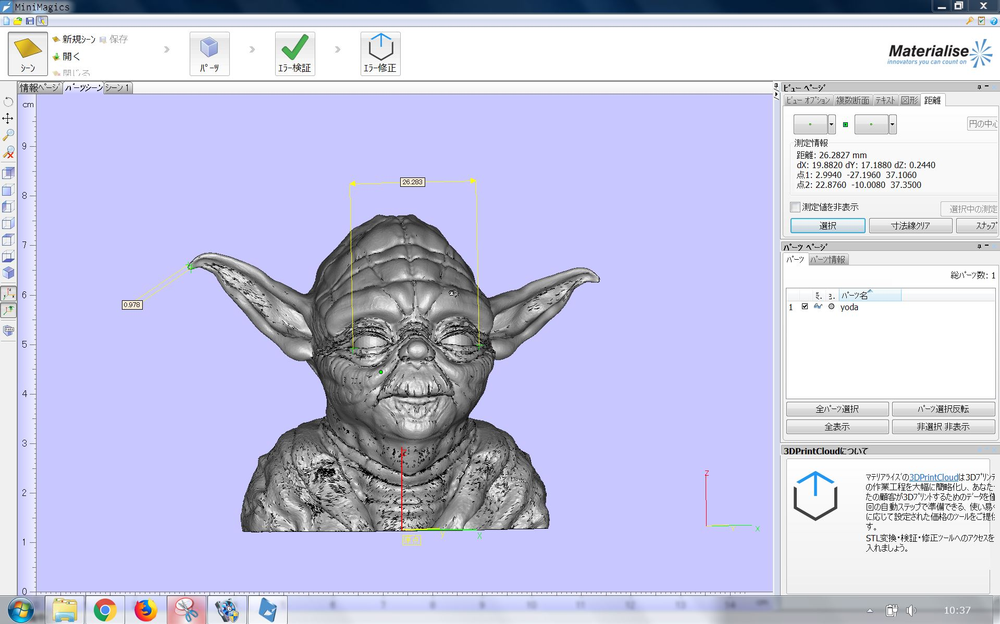
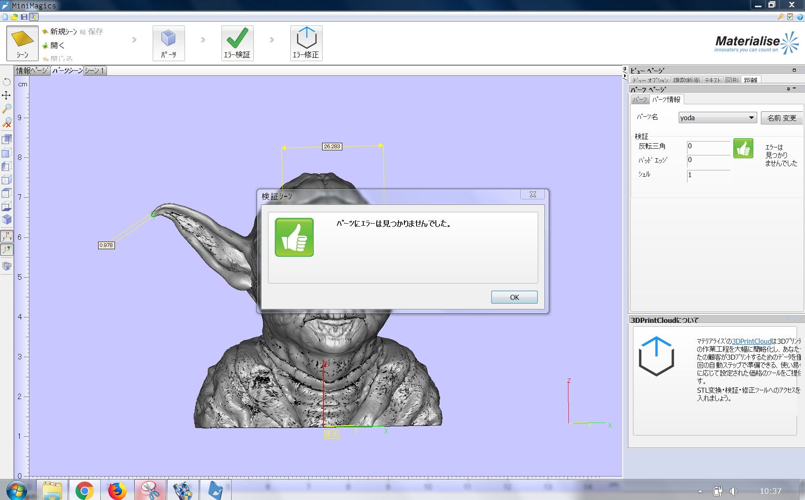
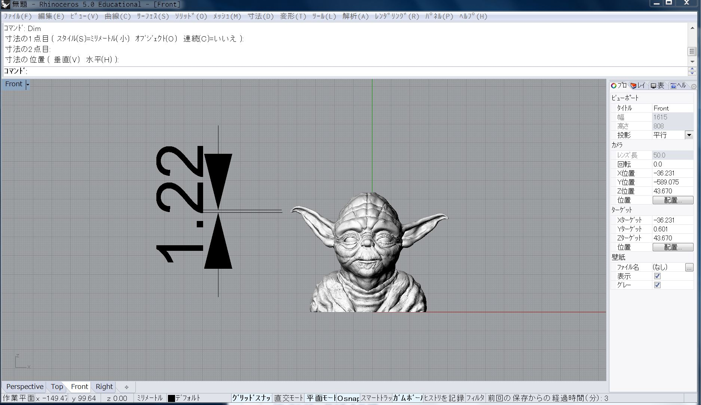

すこしデータチェックできるソフト  

Materialise MiniMagics  

Win のみ

---  

STLファイル閲覧、寸法測定、エラー箇所表示など、基礎的な3Dプリント用データ準備を可能にするフリーウェア Materialise MiniMagics。3Dプリントサービス利用前にSTLファイルのエラー有無を調べる際にも最適です。

[http://www.materialise.com/ja/software/minimagics](http://www.materialise.com/ja/software/minimagics)  

---  

2点間の距離計測  

  

  

エラーチェック  
(エラー修正は有料っぽい)  

  

Rhino の Dim コマンド  

  

---  

