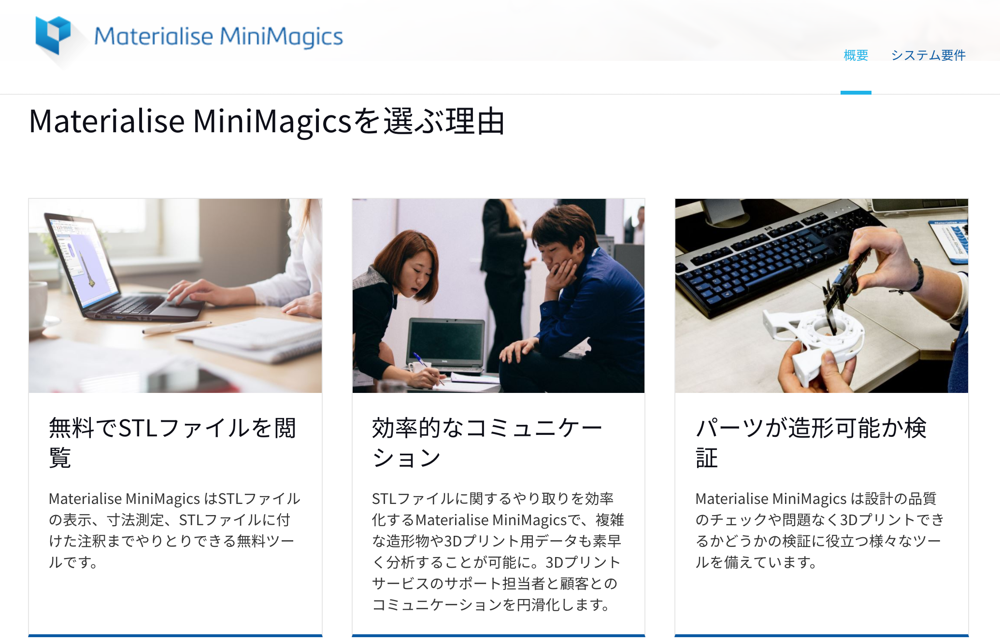

すこしデータチェックできるソフト  

### Materialise MiniMagics  

Win のみ、フリーソフト  

---  

STLファイル閲覧、寸法測定、エラー箇所表示など、基礎的な3Dプリント用データ準備を可能にするフリーウェア Materialise MiniMagics。3Dプリントサービス利用前にSTLファイルのエラー有無を調べる際にも最適です。  

（公式サイトより（
[http://www.materialise.com/ja/software/minimagics](http://www.materialise.com/ja/software/minimagics)  ））

（パーツが造形可能か検証という言葉と、ノギスの写真があるので、肉厚とかも測れそうなのだけど、細かくはまだ見てない）  
  

---  

##### 2点間の距離計測  

  

  

##### エラーチェック  
(エラー修正は、別サービスに飛んでそれは有料っぽい)  

  

##### Rhino の Dim コマンド  

  

---  

自分の手元の環境であれば、  
STL を開けるソフトと、スライサは、 repetier-host と XYZ ware くらいなので、  
その辺に比べたら、寸法測れる分 MiniMagics の方が多少優れてるって感じ、、  

いいスライサがあれば、多分それで、計測、データチェックから、スライスできるので、普通にそれで済みそう。  

本当にちゃんと計測したければ、 Rhinoceros でやったほうがいいや、と思ったりします。  
