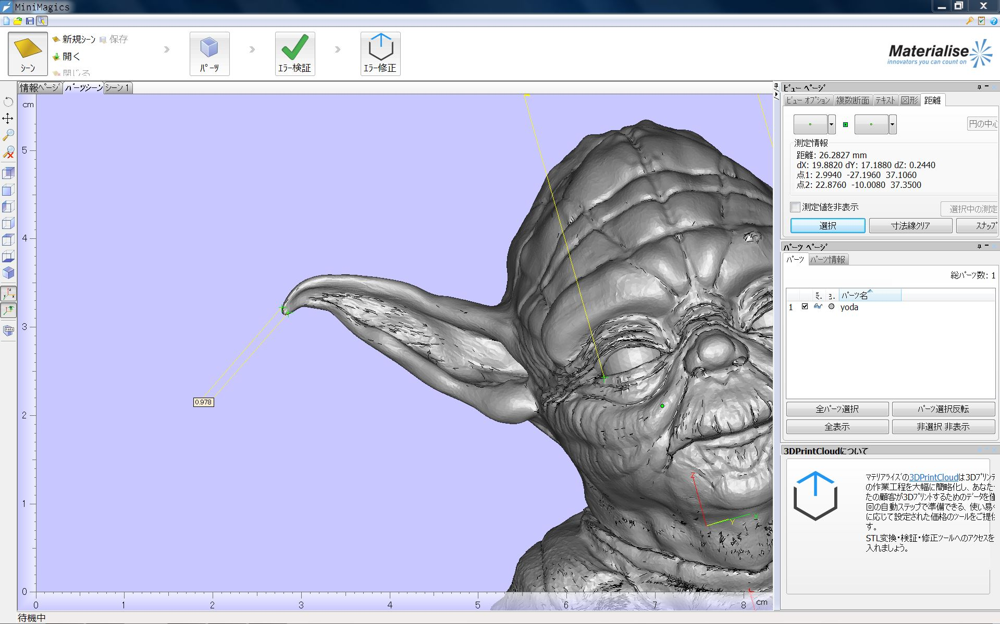

#Materialise MiniMagics  

すこしデータチェックできるソフト  
Win のみ、フリーソフト  

---  

STLファイル閲覧、寸法測定、エラー箇所表示など、基礎的な3Dプリント用データ準備を可能にするフリーウェア Materialise MiniMagics。3Dプリントサービス利用前にSTLファイルのエラー有無を調べる際にも最適です。  

（公式サイトより（
[http://www.materialise.com/ja/software/minimagics](http://www.materialise.com/ja/software/minimagics)  ））

（パーツが造形可能か検証という言葉と、ノギスの写真があるので、肉厚とかも測れそうなのだけど、細かくはまだ見てない）  
  

マニュアルの PDF が合わせて落とせたので、後で見る。  

---  

### 2点間の距離計測  

サイトの造形可能かチェックというノギスの写真で期待するような、肉厚の自動での計測は無いっぽいので、  
断面表示機能があるので、それと計測を組み合わせて、手動で肉厚をチェックできるくらい？  

  

  

  

### エラーチェック  

(エラー修正は、別サービスに飛んでそれは有料っぽい)  
反転したメッシュ面は、別の色で表示？  

  

### Rhino の Dim コマンド  

検証も what コマンド使えば、閉じてる/開いてる/そもそも破損している等、どういう状態かがちゃんと出る  

  

---  

自分の手元の環境は、  
STL を開けるソフトと、スライサは、 repetier-host と XYZ ware くらいなので、  
~~その辺に比べたら、寸法測れる分 MiniMagics の方が多少優れてるって感じ、、~~  
断面の機能があるので、この2つよりはかなり良さそう。  

いいスライサがあれば、多分それで、計測、データチェックから、スライスできるので、普通にそれで済むのかな。  

本当にちゃんと計測や検証をしたければ、 Rhinoceros でやったほうがいいや、と思ったりします。  
